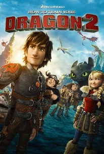

How to Train Your Dragon 2
==========================

``8/10 Cravens``

.. image from: https://resizing.flixster.com/xxEA1xPk_gz6EXv87CO9jQH2ihw=/206x305/v1.bTsxMTE4MTQyNjtqOzE3OTQ5OzEyMDA7ODAwOzEyMDA

Synopsis
--------

DreamWorks Animation returns with the sequel to *How to Train Your Dragon*. 
Hiccup has grown since we last saw him and his adventure is not over yet. 
Along with his dragon Toothless, they must protect their friends and the dragon 
species from danger as the enemy Drago threatens their safety. Eventually, 
Hiccup comes across a cave that holds a secret that changes his life forever. 
He learns about his past and something about the dragons 
that he was not aware of before.

* Rating: PG
* Director: Dean Deblois
* In Theaters: June 13, 2014
* Runtime: 1 hour 42 minutes
* Studio: DreamWorks Animation

Watch the trailer `here <https://youtu.be/2BP38770KNo>`_.

Cast
----

========================= ================
Actor                     Role       
========================= ================
Jay Baruchel              Hiccup
Gerard Butler             Stoick
America Ferrera           Astrid
Jonah Hill                Snotlout
Christopher Mints Plasse  Fishlegs
Craig Ferguson            Gobber
========================= ================

Review
------

This sequel is a significant improvement from the first movie. 
Not only has the animation become crisper, but the story 
is more thrilling than before. The hints of humor add extra 
charm to the overall atmosphere of the film. The producers did 
a splendid job aging the characters appropriately and 
delivering a story that connected with the last one. 
It makes us yearn for a third movie just as good as the second.