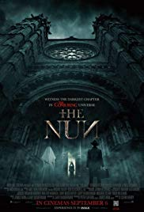

The Nun
=======

Movie info for The Nun
----------------------
Full cast `here <https://en.wikipedia.org/wiki/The_Nun_(2018_film)#Cast>`_.

Movie Summary
-------------
When a young nun at a sheltered abbey in Romania takes her own life, a priest and
a novitiate on the threshold of her final vows are sent by the Vatican to investigate.
Together they uncover the truth about that abbey and the unholy secrets of the
order. Risking their lives and testing their faith and souls, they confront the
malevolent force that takes the form of a nun, the same one from "The Conjuring 2".
The abbey becomes a place where the holy faces the unholy.

Review for The Nun
------------------
2/10 Cravens
Being another film in The Conjuring universe and a prequel, it leaves a rather
poor taste. This film explored the roots of the evil nun that terrorized
characters from the main series and does offer a lot of background information.
The failure of the movie was that it was trying to be a horror movie. It felt as
if the nun was censored a bit compared to all the hype and PR surrounding it.
This movie had just a handful of jump scares and a lot of exposition to explain 
what is the nun. This movie did not leave any feeling of horror or jump at all 
and like the nun at the end, should be sealed back into production.

