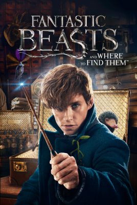

Fantastic Beasts and Where to Find Them 
=======================================

.. no copyright infringement is intended with iTunes/Apple.

Watch the trailer for *Fantastic Beasts and Where to Find Them* `here`_.

.. _here: https://www.youtube.com/watch?v=ViuDsy7yb8M
.. No copyright infringement is intended with Warner Bros. Pictures with the 
   use of this video through Youtube.

Movie Info
----------

+----------------+--------------------------------+
|    **Rating**: | PG-13                          | 
+----------------+--------------------------------+
|     **Genre**: | Sci-Fi, Fantasy                |
+----------------+--------------------------------+
|**Directed by**:| David Yates (II)               |
+----------------+--------------------------------+
|**In theaters**:| Nov 28, 2016                   |
+----------------+--------------------------------+
|   **Runtime**: | 132 minutes                    | 
+----------------+--------------------------------+
|    **Studio**: | Warner Bros. Pictures          |
+----------------+--------------------------------+

Fantastic Beasts and Where to Find Them, brings the Wizarding World back to life 
through the magical creatures of Newt Scamander. Scamander finds himself in New 
York while traveling the world examining and helping mystical creatures of all 
sorts. While in New York, Newt finds trouble with a No-Maj (Muggle) who releases 
some of his magic beasts into the No-Maj world of New York. Can Newt capture all 
of his creatures while helping New York find an answer to their own magical 
problems?

Major Cast Members and Roles
----------------------------

* Eddie Redmayne as *Newt Scamander*
* Colin Farrell as *Graves*
* Katherine Waterston as *Tina*
* Dan Folger as *Jacob Kowalski*
* Ezra Miller as *Credence Barebone*
* Johnny Depp as *Grindelwald*

Review
------

6.5/10 Cravens 

Fantastic Beasts is a creative movie playing on the idea of the Harry Potter 
series. This movie brings a new magical twist to the Wizarding World we all know 
and love, but lacks the development of individual characters throughout the 
movie. Overall, this movie is just above average finding tough criticism from 
the success of the Harry Potter series. 

*No copyright infringement is intended with Warner Bros. Pictures (video link) 
and iTunes/Apple (image).*